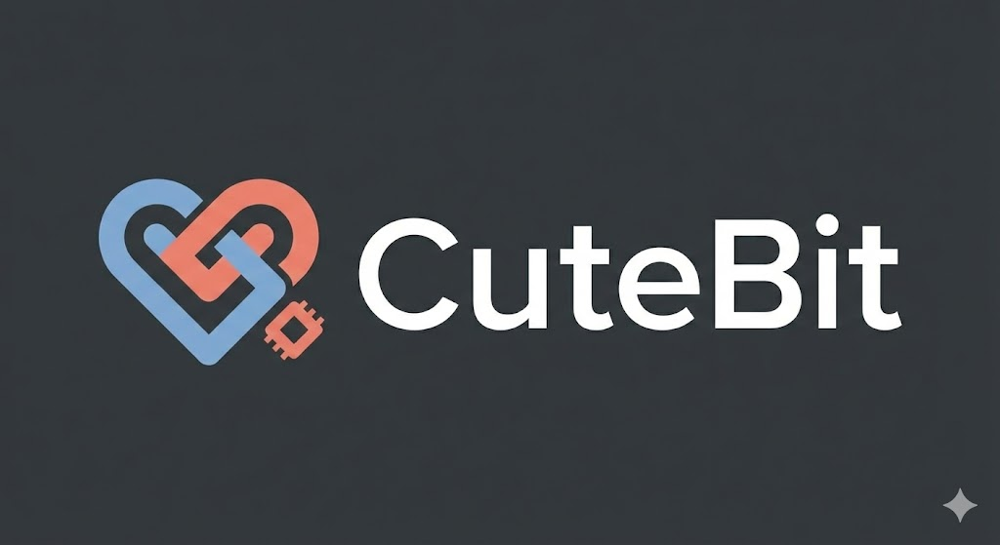

# 🤖 CuteBit
The Expressive AI Desktop Robot **CuteBit** is an open-source, voice-controlled AI robot that combines a powerful **Local LLM "Brain"** (running on a host PC) with an expressive **ESP32 "Body"**. Unlike standard voice assistants, CuteBit has a physical presence, capable of moving, expressing emotions via animated eyes, and responding to natural language commands with personality.

---

## 🌟 Key Features **🧠 Local AI Brain:** Powered by **Ollama (Llama 3)** running locally on a PC/Laptop for privacy and offline capability.
* **👀 Expressive Eyes:** Features a 128x64 OLED display running the **FluxGarage RoboEyes** engine to show emotions (Happy, Angry, Tired, Neutral) synced with its actions.
* **🗣️ Voice Control:** Listens to natural speech commands via Python `SpeechRecognition` and converts intent into physical actions.
* ** Speech ** Talks to us in a human voice.
* **🔌 Hybrid Architecture:**
* **The Brain (Python):** Handles speech-to-text, LLM reasoning, and command parsing.
* **The Body (C++/Arduino):** Handles real-time motor control and display rendering.


* ** 🚗 Mobile Base:** 2-Wheel Drive system capable of navigating its environment based on voice commands.

---

## 🛠️ Tech Stack 
### **Hardware**
* **Microcontroller:** ESP32 (DOIT DEVKIT V1)
* **Display:** 0.96" OLED Display (128x64, I2C, SSD1306 Driver)
* **Motors:** 2x DC Gear Motors with Driver (L298N/L293D)
* **Host Machine:** Laptop/PC (Running the AI Brain)
* **Wireless USB hub:** Raspberry Pi 3B running VirtualHere (to connect ESP32 to Laptop wirelessly)

### **Software*** **Firmware:** Arduino IDE (C++)
* **Backend:** Python 3.10+
* **AI Model:** Ollama (Llama 3 / Mistral)
* **Libraries:**
* *Python:* `ollama`, `SpeechRecognition`, `pyserial`, `edgetts`
* *Arduino:* `FluxGarage RoboEyes`, `Adafruit SSD1306`,


---

## ⚙️ Architecture
CuteBit uses a **Master-Slave Serial Protocol** to bridge high-level AI reasoning with low-level hardware control.

1. **Input:** User speaks a command (e.g., *"CuteBit, come here and look happy!"*).
2. **Reasoning:** The Python script captures audio, converts it to text, and feeds it to the Local LLM with a strict System Prompt.
3. **Parsing:** The LLM returns a JSON object containing the **Verbal Response**, **Action**, and **Emotion**.
```json
{
  "response": "Coming to you!",
  "action": "forward",
  "emotion": "happy"
}

```


4. **Execution:** Python sends a serial packet `[1, 1]` (Action ID, Emotion ID) to the ESP32.
5. **Reaction:** The ESP32 triggers the motors and updates the OLED eye animation instantly.
6. **Speech** The verbal response goes to Edge TTS Engine.

---


---

## 👨‍💻 Author **Arjun Kulkarni**
*Electronics & Communication Engineering (AI & ML)*
*MIT-WPU, Pune*

---

